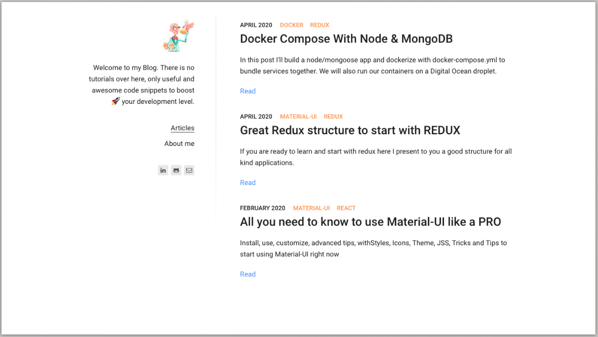

## nicopixel
[nicopixel.com](https://nicopixel.com/) is my personal blog, a place where you can find short posts with a lot of information about Javascript, Node, React, Redux... and all that I want to remember.

[nicopixel.com](https://nicopixel.com/) is based on [Gatsby](https://github.com/gatsbyjs/gatsby) an excellent CMS built with the power of React and GarphQL. The template/theme that I'm using is a fork of [gatsby-starter-lumen](https://github.com/alxshelepenok/gatsby-starter-lumen)

## Theme Features
+ Lost Grid ([peterramsing/lost](https://github.com/peterramsing/lost)).
+ Beautiful typography inspired by [matejlatin/Gutenberg](https://github.com/matejlatin/Gutenberg).
+ [Mobile-First](https://medium.com/@mrmrs_/mobile-first-css-48bc4cc3f60f) approach in development.
+ Stylesheet built using SASS and [BEM](http://getbem.com/naming/)-Style naming.
+ Syntax highlighting in code blocks.
+ Sidebar menu built using a configuration block.
+ Archive organized by tags and categories.
+ Automatic RSS generation.
+ Automatic Sitemap generation.
+ Offline support.
+ Google Analytics support.
+ Disqus Comments support.

## Running in Development
If you want to run [nicopixel.com](https://nicopixel.com/) locally you can use `gatsby develop` command

## Blog Screenshot

## Design IDEA
[nicopixel.com](https://nicopixel.com/) is base on the image of the crazy scientist

## Work in progress

+ About me page
+ Form to let everyone send their amazing code snippets
+ Search bar
+ Optional feature image in posts

