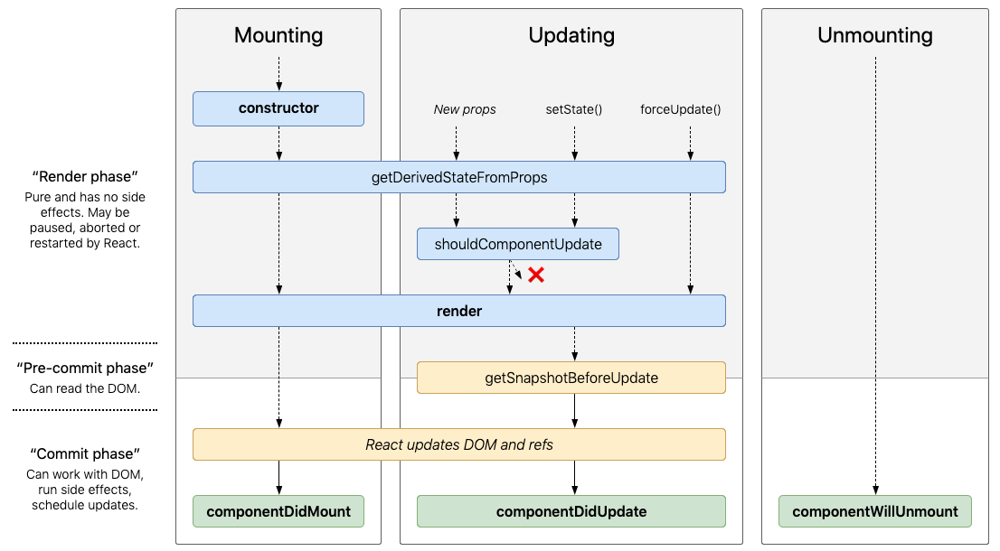

You **mustn't forget React Classes** (or some important concepts related with them). You need to know how to mantein some code created with Classes and maybe convert it to Hooks (hopefully 😎) I forget Classes during almost a year and I regret about it. So, let's to change that and review some important concepts

### bind or not bind, that is the question

#### binding - option 1
In JavaScript, class methods are not bound by default.
```js
class Toggle extends React.Component {
  constructor(props) {
    super(props);
    this.state = {isToggleOn: true};

    // This binding is necessary to make `this` work in the callback
    this.handleClick = this.handleClick.bind(this);
  }

  handleClick() {
    // without binding this in the constructor we get this undefined
    this.setState(state => ({
      isToggleOn: !state.isToggleOn
    }));
  }

  render() {
    return (
      <button onClick={this.handleClick}>
        {this.state.isToggleOn ? 'ON' : 'OFF'}
      </button>
    );
  }
}
```

#### binding - option 2
If you created you app with `create-react-app` you are using [public class fields syntax](https://babeljs.io/docs/en/babel-plugin-transform-class-properties/) which allows  arrow functions which do auto-binding:

```js
class Toggle extends React.Component {
  constructor(props) {
    super(props);
    this.state = {isToggleOn: true};
    // not necessary bind in the constructor
  }

  // This syntax ensures `this` is bound within handleClick.
  // Warning: this is experimental syntax.
  handleClick = () => {
    this.setState(state => ({
      isToggleOn: !state.isToggleOn
    }));
  }

  render() {
    return (
      <button onClick={this.handleClick}>
        {this.state.isToggleOn ? 'ON' : 'OFF'}
      </button>
    );
  }
}
```

#### binding - option 3
Or you can use arrow function on the onClick event:
```js
class Toggle extends React.Component {
  constructor(props) {
    super(props);
    this.state = { isToggleOn: true };
  }

  handleClick() {
    this.setState(state => ({
      isToggleOn: !state.isToggleOn
    }));
  }

  render() {
    // This syntax ensures `this` is bound within handleClick
    return (
      <button onClick={() => this.handleClick()}>
        {this.state.isToggleOn ? 'ON' : 'OFF'}
      </button>
    );
  }
}
```

The recomendation is **binding in the constructor or using the class fields syntax**, to avoid this sort of performance problem.

## Lifecycle methods


_* [RARE USE CASES] means you must avoid that methods. Maybe only exists as a performance optimization or you must find other ways. You must read [this](https://reactjs.org/blog/2018/06/07/you-probably-dont-need-derived-state.html) in order to know all posibilities_

## MOUNTING 

### 1. constructor(props)
- Called before is Mounted
- If you don’t initialize state and you don’t bind methods, you don’t need to implement a constructor for your React component

```js
constructor(props) {
  // you should call super(props) before any other statement
  super(props);

  // Don't call this.setState() here!
  this.state = { counter: 0 };
  this.handleClick = this.handleClick.bind(this);

  // Avoid copying props into state! This is a common mistake:
  // Only use this pattern if you intentionally want to ignore prop updates 
  // (change also the name to initialColor or something like this)
  this.state = { color: props.color };
}
```

- If you don’t bind methods but you want initialize state you can simply put

```js
  state = { color: '#FFFFFF' };
  // you don't have access to the props anymore with this syntax
```
- Thanks to [Class Definition](http://es6-features.org/#ClassDefinition)

### <a name="getDerivedStateFromProps">2 . getDerivedStateFromProps(props, state) - [RARE USE CASES]</a>

- Is invoked right before calling the render method, both **on the initial mount** and on subsequent updates
- Deriving state leads to verbose code and makes your components difficult to think about
- Exists for only one purpose: It enables a component to update its internal state as the result of changes in props

READ => https://reactjs.org/blog/2018/06/07/you-probably-dont-need-derived-state.html

### 3. RENDER
- Required in a Class component

#### 4. ComponentDidMount()
- Good place to set up any subscriptions
- It will trigger an extra rendering, but it will happen before the browser updates the screen. This guarantees that even though the render() will be called twice in this case, the user won’t see the intermediate state.

```js
componentDidMount() {
  // whatever you want call to api const { data } = this.fetchData()
  this.setState({ user: data ));
}
```

**componentDidMount() Hook equivalent**

```js
useEffect(() => {
  // Your code here
}, []);
```

## UPDATING

### [1. getDerivedStateFromProps(props, state)](#getDerivedStateFromProps)

#### 2. shouldComponentUpdate(nextProps, nextState) - [RARE USE CASES]
- This method **is not called for the initial** render or when forceUpdate() is used
- return false to tell React the update can be skipped or return true execute the render

```js
shouldComponentUpdate(nextProps, nextState) {
  // return true or false
}
```
### 3. RENDER

### 4. getSnapshotBeforeUpdate(prevProps, prevState) - [RARE USE CASES]

- Is invoked right before the most recently rendered output is committed
- This use case is not common, but it may occur in UIs like a chat thread that need to handle scroll position in a special way
- Any value returned by this lifecycle **will be passed as a parameter to componentDidUpdate()**

```js
  getSnapshotBeforeUpdate(prevProps, prevState) {
    // Are we adding new items to the list?
    // Capture the scroll position so we can adjust scroll later.
    if (prevProps.list.length < this.props.list.length) {
      const list = this.listRef.current;
      return list.scrollHeight - list.scrollTop;
    }
    return null;
  }

  componentDidUpdate(prevProps, prevState, snapshot) {
    // If we have a snapshot value, we've just added new items.
    // Adjust scroll so these new items don't push the old ones out of view.
    // (snapshot here is the value returned from getSnapshotBeforeUpdate)
    if (snapshot !== null) {
      const list = this.listRef.current;
      list.scrollTop = list.scrollHeight - snapshot;
    }
  }
```

### 5. componentDidUpdate(prevProps, prevState, snapshot) 
- Is invoked immediately after updating occurs
- Opportunity to operate on the DOM when the component has been updated
- will not be invoked if shouldComponentUpdate() returns false (logically right?)
 
```js
componentDidUpdate(prevProps) {
  // Typical usage (don't forget to compare props):
  if (this.props.userID !== prevProps.userID) {
    this.fetchData(this.props.userID);
  }

  // You may call setState() immediately in componentDidUpdate() 
  // but note that it must be wrapped in a condition like in the 
  // example above, or you’ll cause an infinite loop

  // It would also cause an extra re-rendering which, while not 
  // visible to the user, can affect the component performance
}
```

**componentDidUpdate(prevProps) Hook equivalent**

```js
useEffect(() => {
  // Your code here
}, [yourDependency]);
```

## UNMOUNTING
### 1. componentWillUnmount()
- Is invoked immediately before a component is unmounted and destroyed
- Perfect place to do things such as invalidating timers, canceling network requests, or cleaning up any subscriptions that were created in componentDidMount()
- You should not call setState() in componentWillUnmount() because the component will never be re-rendered

```js
  componentWillUnmount() {
    document.removeEventListener("click", this.closeMenu)
  }
```

**componentWillUnmount() Hook equivalent**

```js
useEffect(() => {
  // componentWillUnmount
  return () => {
     // Your code here
  }
}, [yourDependency]);
```

### Refs and the DOM
A way to access DOM nodes or React elements created in the render method. There are a few cases where you need to imperatively modify a child (an instance of a React component, or it could be a DOM element) outside of the typical dataflow (parent-child)

There are a few good use cases for refs:

- Managing focus, text selection, or media playback.
- Triggering imperative animations.
- Integrating with third-party DOM libraries.

```js
class MyComponent extends React.Component {
  constructor(props) {
    super(props);

    // initialize
    this.myRef = React.createRef();
  }
  render() {
    return <div ref={this.myRef} />;
  }
}
```

- When a ref is passed to an element in render, a reference to the node becomes accessible at the current attribute of the ref
- When the ref attribute is used on an HTML element, the ref created in the constructor with React.createRef() receives the underlying DOM element as its current property
- When the ref attribute is used on a custom class component, the ref object receives the mounted instance of the component as its current
- You may not use the ref attribute on function components because they don’t have instances

```js
class CustomTextInput extends React.Component {
  constructor(props) {
    super(props);
    // create a ref to store the textInput DOM element
    this.textInput = React.createRef();
    this.focusTextInput = this.focusTextInput.bind(this);
  }

  focusTextInput() {
    // Explicitly focus the text input using the raw DOM API
    // Note: we're accessing "current" to get the DOM node
    this.textInput.current.focus();
  }

  render() {
    // tell React that we want to associate the <input> ref
    // with the `textInput` that we created in the constructor
    return (
      <div>
        <input
          type="text"
          ref={this.textInput} />
        <input
          type="button"
          value="Focus the text input"
          onClick={this.focusTextInput}
        />
      </div>
    );
  }
}
```

React assign the current property back to null when it unmounts

You may not use the ref attribute on function components:
```js
render() {
  // This will *not* work!
  return (
    <MyFunctionComponent ref={this.textInput} />
  );
}
```

You can, use the ref attribute inside a function component:
```js
function CustomTextInput(props) {
  // textInput must be declared here so the ref can refer to it
  const textInput = useRef(null);
  
  function handleClick() {
    textInput.current.focus();
  }

  return (
    <div>
      <input
        type="text"
        ref={textInput} />
      <input
        type="button"
        value="Focus the text input"
        onClick={handleClick}
      />
    </div>
  );
}
```

### Also, remember

- State Updates May Be Asynchronous, so you can use the arrow functions like this:
```js
this.setState((state, props) => ({
  counter: state.counter + props.increment
}));       
```

- Passing arguments to event handlers
```js
{/* we have to pass the react event explicitly */}
<button onClick={(e) => this.deleteRow(id, e)}>Delete Row</button>
{/* any further arguments are automatically forwarded */}
<button onClick={this.deleteRow.bind(this, id)}>Delete Row</button>
```

- The terms “controlled” and “uncontrolled” usually refer to form inputs, but they can also describe where any component’s data lives. Data passed in as props can be thought of as controlled (because the parent component controls that data). Data that exists only in internal state can be thought of as uncontrolled (because the parent can’t directly change it).