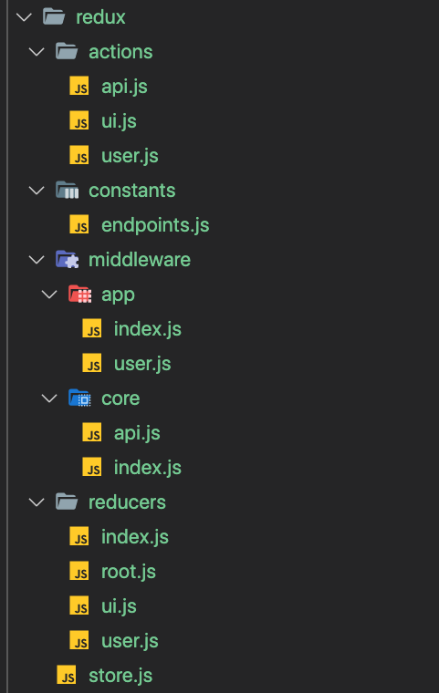
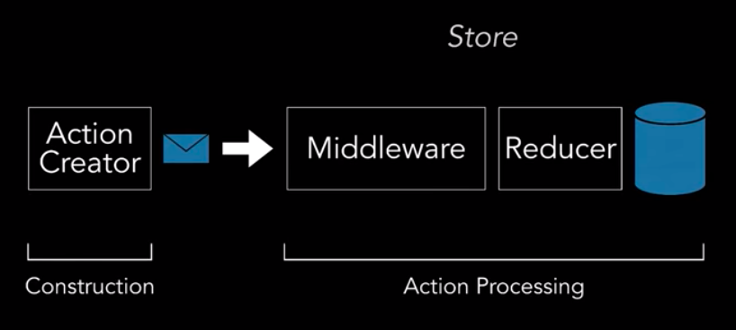

The main concepts shown in this reference post are base on [this](https://github.com/demo-projects/redux-patterns-demo/tree/finish) excelente structure created by [@nirkaufman](https://github.com/nirkaufman). You can download the structure from [ZIP File from @nirkaufman repository](https://github.com/demo-projects/redux-patterns-demo/archive/finish.zip)

## REDUX structure
Here the main REDUX structure we are going to follow:


## Main Redux Flow


#### Things to keep in mind

- The most advanced part and where all logic produced are middlewares (side effects)
- All action which start with `SET_` are managed by reducer and change the redux state


## actions
### `api.js`
```jsx
export const API_REQUEST = 'API_REQUEST'
export const API_SUCCESS = 'API_SUCCESS'
export const API_ERROR = 'API_ERROR'

export const apiRequest = (body, method, entity, command, params) => ({
  type: `${entity} ${API_REQUEST}`,
  payload: {
    data: body,
    meta: { method, entity, command, params }
  }
})

export const apiSuccess = (response, entity, actionType) => ({
  type: `${entity} ${API_SUCCESS}`,
  payload: {
    data: response,
    meta: { entity, actionType }
  }
})

export const apiError = (error, entity, actionType) => ({
  type: `${entity} ${API_ERROR}`,
  payload: {
    data: error,
    meta: { entity, actionType }
  }
})
```

### `ui.js`
```jsx
export const UI_ENTITY = `[ ui ]`
export const SET_ERROR = `${UI_ENTITY} SET_ERROR`

export const SET_LOADER = `${UI_ENTITY} SET_LOADER`
export const SET_SIDEBAR_TOGGLE = `${UI_ENTITY} SET_SIDEBAR_TOGGLE`

export const setLoader = isLoading => ({
  type: `${UI_ENTITY} ${SET_LOADER}`,
  payload: isLoading
})

export const setSidebarToggle = toggle => ({
  type: `${UI_ENTITY} ${SET_SIDEBAR_TOGGLE}`,
  payload: toggle
})

export const setError = (error, entity) => ({
  type: `${entity} ${SET_ERROR}`,
  payload: error
})
```

### `user.js`
```jsx
export const USER_ENTITY = '[ user ]'
export const LOG_IN_USER = `${USER_ENTITY} LOG_IN_USER`
export const LOG_OUT_USER = `${USER_ENTITY} LOG_OUT_USER`
export const LOG_IN_USER_ERROR = `${USER_ENTITY} LOG_IN_USER_ERROR`
export const RETRIEVE_MY_USER = `${USER_ENTITY} RETRIEVE_MY_USER`
export const SET_MY_USER = `${USER_ENTITY} SET_MY_USER`

export const setMyUser = userData => ({
  type: `${USER_ENTITY} ${SET_MY_USER}`,
  payload: userData
})

export const retrieveMyUser = () => ({
  type: LOG_IN_USER
})
```

## constants
### `endpoint.js`
```jsx
import { LOGIN_USER } from '../actions'

export const ENDPOINTS = () => ({
  [LOGIN_USER]: `/user/login`
})
```

## middleware
### `app/index.js`
```jsx
import { usersMiddleware } from './user'

export const appMdl = [usersMiddleware]
```

### `app/user.js`
```jsx
import { RETRIEVE_MY_USER, USER_ENTITY, LOG_IN_USER, LOG_IN_USER_ERROR, setMyUser } from '../../actions/user'
import { API_SUCCESS, apiRequest, API_ERROR } from '../../actions/api'
import { setError } from '../../actions/ui'

export const usersMiddleware = ({ dispatch }) => next => async action => {
  next(action)

  let actionType
  switch (action.type) {
    case LOG_IN_USER:
      dispatch(apiRequest('POST', '/user/login', null, LOG_IN_USER, LOG_IN_USER_ERROR))
      break

    case `${USER_ENTITY} ${API_SUCCESS}`:
      actionType = action.payload.meta.actionType

      if (actionType === LOG_IN_USER) {
        const { data: token } = action.payload
        // eslint-disable-next-line no-undef
        sessionStorage.token = token
      }

      if (actionType === RETRIEVE_MY_USER) {
        const { data: user } = action.payload
        dispatch(setMyUser(user))
      }
      break

    case `${USER_ENTITY} ${API_ERROR}`:
      actionType = action.payload.meta.actionType

      if (actionType === RETRIEVE_MY_USER) {
        const error = action.payload.data
        dispatch(setError(error))
      }
      break

    default:
      break
  }
}
```

### `core/api.js`
```jsx
import { API_REQUEST } from '../../actions/api'

export const api = ({ dispatch }) => next => action => {
  if (action.type === API_REQUEST) {
    const { method, url, onSuccess, onError } = action.meta

    fetch(url, { method }).then(response => response.json())
      .then(data => dispatch({ type: onSuccess, payload: data }))
      .catch(error => dispatch({ type: onError, payload: error }))
  }
  return next(action)
}
```

### `core/index.js`
```jsx
import { apiMdl } from './api'
export const coreMdl = [apiMdl]
```

## reducers
### `root.js`
```jsx
import { appReducers } from '.'
import { userReducerInitialState, LOG_OUT_USER } from './user'
import { uiReducerInitialState } from './ui'

export const rootReducer = (state, action) => {
  if (action.type === LOG_OUT_USER) {
    return appReducers({ user: userReducerInitialState, ui: uiReducerInitialState }, action)
  }

  return appReducers(state, action)
}
```

### `ui.js`
```jsx
import { SET_LOADER, SET_SIDEBAR_TOGGLE } from '../actions/ui'

export const uiReducerInitialState = {
  isLoading: false,
  isSidebarOpen: true
}

export function uiReducer(state = uiReducerInitialState, action) {
  switch (action.type) {
    case SET_LOADER:
      return {
        ...state,
        isLoading: action.payload
      }

    case SET_SIDEBAR_TOGGLE:
      return {
        ...state,
        isSidebarOpen: action.payload
      }
    default:
      return state
  }
}
```

### `user.js`
```jsx
import { SET_MY_USER } from '../actions/user'

export const userReducerInitialState = false

export function userReducer(state = userReducerInitialState, action) {
  switch (action.type) {
    case SET_MY_USER:
      return {
        data: action.payload || false,
        error: false
      }

    default:
      return state
  }
}
```

## `store.js`
```jsx
import { createStore, applyMiddleware } from 'redux'
import { rootReducer } from './reducers/user'

import { coreMdl } from './middleware/core'
import { appMdl } from './middleware/app'

const composeEnhancers = window.__REDUX_DEVTOOLS_EXTENSION_COMPOSE__ || compose

export const store = createStore(
  rootReducer,
  applyMiddleware(...appMdl, ...coreMdl)
)
```

### `index.js`
```jsx
import { combineReducers } from 'redux'
import { uiReducer } from '../reducers/ui'
import { userReducer } from '../reducers/user'

const globalInitialState = {
  user: userReducer,
  ui: uiReducer
}

export const appReducers = combineReducers(globalInitialState)
```

