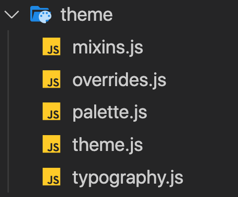

## Install
First install @material-ui core. This is the main library to use the main library

```shell 
npm install @material-ui/core
```

```shell 
yarn add @material-ui/core
```

## Using with default styles
- All components in @MUI comes with default styles (with a [default theme](https://material-ui.com/customization/default-theme/)).

```jsx
import react from 'react'
import { Button } from '@material-ui/core'

const MyComponent = () => {
  return <Button>Material UI Button</Button>
}

export default MyComponent
```

## Using with custom styles
- Using `className` in the MUI Button component is enough to apply your CSS rules

##### withStyles HOC
```jsx
import react from 'react'
import { Button, withStyles } from '@material-ui/core'

// can be an object
const customStyles = {
  myCustomClass: {
    textTransform: 'uppercase'
  }
}

// also can be a function receiving theme as parameter
// in this case you have to return an object
const customStyles = theme => ({
  myCustomClass: {
    textTransform: 'uppercase',
    padding: theme.spacing(3),
    color: theme.palette.primary.main
  }
})

const MyComponent = ({ classes }) => {
  return <Button className={classes.myCustomClass}>
          Material UI Button
         </Button>
}

export default withStyles(customStyles)(MyComponent)
```

##### makeStyles HOOK
```jsx
import react from 'react'
import { Button, makeStyles } from '@material-ui/core'

// you can use also an object as parameter for makeStyles
const useMyComponentStyle = makeStyles((theme) => ({
  myCustomClass: {
    textTransform: 'uppercase',
    padding: theme.spacing(3),
    color: theme.palette.primary.main
  }
}))

const MyComponent = () => {
  const classes = useMyComponentStyle()
  return <Button className={classes.myCustomClass}>
              Material UI Button
         </Button>
}

export default MyComponent
```

## Using overriding the internal Material-UI styles
To override styles you have to use the prop `classes` in the @MUI component. All Material-UI components have the `classes` style.

You can find a list with all styles applied to the component in the API docs. For example, for the Button component [here](https://material-ui.com/api/button/#css) you can find all css rule name applied

```jsx
import react from 'react'
import { Button, withStyles } from '@material-ui/core'

// also can be a function receiving theme as parameter
// in this case you have to return an object
const customStyles = theme => ({
  myDisabledButton: {
    color: theme.palette.secondary.main
  }
})

// overriding the root class from the Button component
const MyComponent = ({ classes }) => {
  return <Button classes={{ disabled: classes.myDisabledButton }}>
          Material UI Button
         </Button>
}

export default withStyles(customStyles)(MyComponent)
```
We are overriding the `disabled` class

#### Media queries in Material-UI

Material-UI comes by default with the following breakpoints:

- `xs` (extra-small): 0px
- `sm` (small): 600px
- `md` (medium): 960px
- `lg` (large): 1280px
- `xl` (extra-large): 1920px

Also, you can use the really useful helpers:

- `theme.breakpoints.up(key)`
- `theme.breakpoints.down(key)`
- `theme.breakpoints.only(key)`
- `theme.breakpoints.between(start, end)`

```jsx
import react from 'react'
import { Button, withStyles } from '@material-ui/core'

const customStyles = theme => ({
  myDisabledButton: {
    [theme.breakpoints.down('sm')]: {
      backgroundColor: theme.palette.secondary.main
    },
    [theme.breakpoints.up('md')]: {
      backgroundColor: theme.palette.primary.main
    }
  }
})

const MyComponent = ({ classes }) => {
  return <Button classes={{ disabled: classes.myDisabledButton }}>
          Material UI Button
         </Button>
}

export default withStyles(customStyles)(MyComponent)
```

#### Creating a Material-UI theme

```jsx
import React from 'react'
// CssBaseline help us to normalize styles
import { CssBaseline } from '@material-ui/core'
import { ThemeProvider } from '@material-ui/core/styles'

import App from './components/App.jsx'
import theme from './path/to/your/theme'

ReactDOM.render(
    <ThemeProvider theme={theme}>
            <CssBaseline />
            <App />
    </ThemeProvider>,
    document.getElementById('root'))
```

Now you only need to create the theme file. My recomendation is create a files structure like this:



This ensures you to have a really good structure in case you App grows a lot. Once you have created this structure let's go to see every file:

#### mixins.js

```jsx

/**
 * Creates all flex rules
 * @param {String} flexFlow
 * @param {String} justifyContent
 * @param {String} alignItems
 */
const flexy = (flexFlow, justifyContent, alignItems) => ({
  display: 'flex',
  flexFlow,
  justifyContent,
  alignItems,
})

/**
 * Convert HEX color to rgb with opacity
 * convertToRGB('#cccccc', 0.5) | output => "rgba(204,204,204,0.5)"
 *
 * @param {String} HEXColor - starting with '#'
 * @param {Number} opacity
 */
const convertToRGB = (HEXColor, opacity = 1) => {
  let c
  if (/^#([A-Fa-f0-9]{3}){1,2}$/.test(HEXColor)) {
    c = HEXColor.substring(1).split('')
    if (c.length === 3) {
      c = [c[0], c[0], c[1], c[1], c[2], c[2]]
    }
    c = `${'0x'}${c.join('')}`
    return `rgba(${[(c >> 16) & 255, (c >> 8) & 255, c & 255].join(',')}, ${opacity})`
  }
  throw new Error('Bad HEXColor')
}

export {
  flexy,
  convertToRGB
}
```

#### overrides.js

```jsx
const overrides = {
  MuiInputBase: {
    root: {
      fontSize: '1rem' // overriding all InputBase
    }
  }
}

export { overrides }
```

#### palette.js

```jsx
const palette = {
  primary: {
    main: '#1E5FBB'
  },
  secondary: {
    main: '#F3A700'
  }
}
export { palette }
```
#### typography.js
```jsx
const globalFontRules = {
  fontFamily: "'Roboto',sans-serif",
  fontStyle: 'normal',
  htmlFontSize: 16,
  fontWeight: 300
}

const typography = {
  ...globalFontRules
}

export { globalFontRules, typography }
```
#### theme.js
```jsx
import { createMuiTheme } from '@material-ui/core/styles'

import { palette } from './palette'
import { typography } from './typography'
import { overrides } from './overrides'
import { flexy, convertToRGB } from './mixins'

const theme = createMuiTheme({
  spacing: value => value ** 2,
  palette,
  typography,
  overrides,
  mixins: {
    flexy,
    convertToRGB
  }
})

export default theme
export { palette }
```
