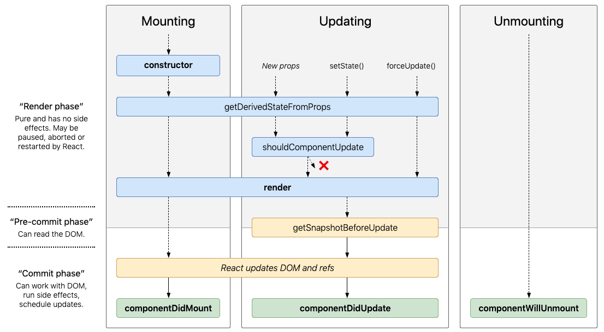

You **mustn't forget React Classes** (or some important concepts related with them). You need to know how to mantein some code created with Classes and maybe convert it to Hooks (hopefully 😎) I forget Classes during almost a year and I regret about it. So, let's to change that and review some important concepts

### bind or not bind, that is the question

#### binding - option 1
In JavaScript, class methods are not bound by default.
```js
class Toggle extends React.Component {
  constructor(props) {
    super(props);
    this.state = {isToggleOn: true};

    // This binding is necessary to make `this` work in the callback
    this.handleClick = this.handleClick.bind(this);
  }

  handleClick() {
    // without binding this in the constructor we get this undefined
    this.setState(state => ({
      isToggleOn: !state.isToggleOn
    }));
  }

  render() {
    return (
      <button onClick={this.handleClick}>
        {this.state.isToggleOn ? 'ON' : 'OFF'}
      </button>
    );
  }
}
```

#### binding - option 2
If you created you app with `create-react-app` you are using [public class fields syntax](https://babeljs.io/docs/en/babel-plugin-transform-class-properties/) which allows  arrow functions which do auto-binding:

```js
class Toggle extends React.Component {
  constructor(props) {
    super(props);
    this.state = {isToggleOn: true};
    // not necessary bind in the constructor
  }

  // This syntax ensures `this` is bound within handleClick.
  // Warning: this is experimental syntax.
  handleClick = () => {
    this.setState(state => ({
      isToggleOn: !state.isToggleOn
    }));
  }

  render() {
    return (
      <button onClick={this.handleClick}>
        {this.state.isToggleOn ? 'ON' : 'OFF'}
      </button>
    );
  }
}
```

#### binding - option 3
Or you can use arrow function on the onClick event:
```js
class Toggle extends React.Component {
  constructor(props) {
    super(props);
    this.state = { isToggleOn: true };
  }

  handleClick() {
    this.setState(state => ({
      isToggleOn: !state.isToggleOn
    }));
  }

  render() {
    // This syntax ensures `this` is bound within handleClick
    return (
      <button onClick={() => this.handleClick()}>
        {this.state.isToggleOn ? 'ON' : 'OFF'}
      </button>
    );
  }
}
```

The recomendation is **binding in the constructor or using the class fields syntax**, to avoid this sort of performance problem.

### Lifecycle methods


#### 1. MOUNTING 
- Called before is Mounted
- If you don’t initialize state and you don’t bind methods, you don’t need to implement a constructor for your React component

```js
constructor(props) {
  // you should call super(props) before any other statement
  super(props);

  // Don't call this.setState() here!
  this.state = { counter: 0 };
  this.handleClick = this.handleClick.bind(this);

  // Avoid copying props into state! This is a common mistake:
  // Only use this pattern if you intentionally want to ignore prop updates 
  // (change also the name to initialColor or something like this)
  this.state = { color: props.color };
}
```

#### 2. shouldComponentUpdate()
- [You should read this](https://felixgerschau.com/react-rerender-components/)
- When the VDOM gets updated, React compares it to to a previous snapshot of the VDOM and then only updates what has changed in the real DOM. If nothing changed, the real DOM won't be updated at all. This process of comparing the old VDOM with the new one is called **diffing**.


#### 3. RENDER
- Required in a Class component


#### 3. ComponentDidMount()
- Good place to set up any subscriptions
- It will trigger an extra rendering, but it will happen before the browser updates the screen. This guarantees that even though the render() will be called twice in this case, the user won’t see the intermediate state.

```js
componentDidMount() {
  // whatever you want call to api const { data } = this.fetchData()
  this.setState({ user: data ));
}
```

**componentDidMount() Hook equivalent**

```js
useEffect(() => {
  // Your code here
}, []);
```

### Also, remember

State Updates May Be Asynchronous, so you can use the arrow functions like this:
```js
this.setState((state, props) => ({
  counter: state.counter + props.increment
}));       
```

Passing arguments to event handlers
```js
{/* we have to pass the react event explicitly */}
<button onClick={(e) => this.deleteRow(id, e)}>Delete Row</button>
{/* any further arguments are automatically forwarded */}
<button onClick={this.deleteRow.bind(this, id)}>Delete Row</button>
```

