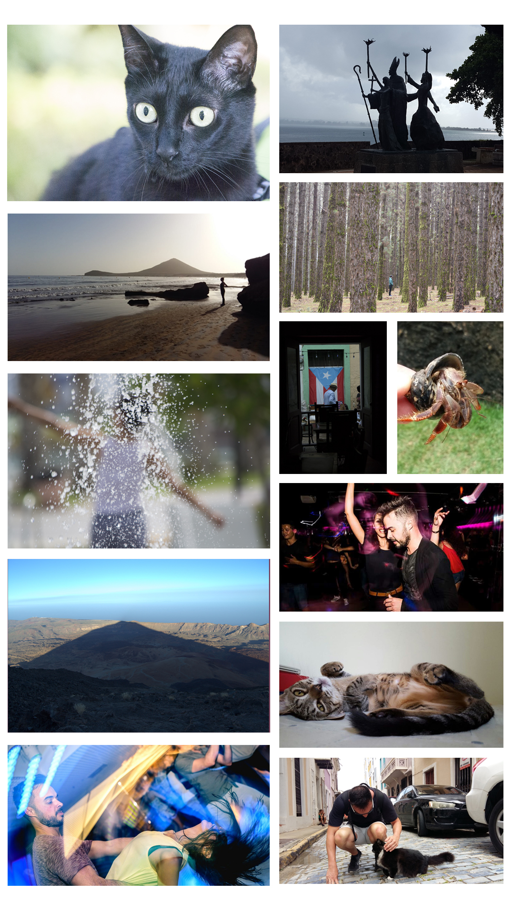

### Curious about me?
First of all thank you for your interesting in my profile. My name is Nicolás Martín and I'll tell you more about my person (no speech over here about my skills and knowledge. If you are interested on that you can go to my [Linked Profile](https://www.linkedin.com/in/nicolasmartinacosta/), [read my blog posts](https://nicopixel.com/) or [download my CV](./cv_nicopixel.pdf).

### This is HOW I AM (not WHAT I KNOW)

## **THIS IS MY MANIFESTO**

### WORK + LIFE. How? 
I strongly believe in the Remote WORK, this is how I want to LIVE. So, henceforth I'll refer to RemoteWork as a RemoteLife or just simply Remote. **Remote is a life style**.

To deny some concepts that I have heard or felt or just to keep in mind, here some important points:

- RemoteLife and TeamWork are allies not enemies.
- Being far away doesn't means disconnection, quite the opposite: RemoteLife forces you to **link people** in a continuous, constantly and focussed way.
- RemoteLife forces you to evaluate your collegues ** based on goals ** and not in time invested
- RemoteLife helps **personal development**
- RemoteLife makes a better developer: **more indepent but more connected, stronger, willing to help, self-confident and more efficient**
- RemoteLife makes me happier thus more productive: RemoteLife it's a great freedom but also a big responsability

**If you are a company and you don't have Remotelife mindset, please don't contact me**

### 60% PLANNING / 40% CODING
It's much more important talk and share thoughs about the HOW than go fast to implement an idea in the code. It's extremely important talk and **explain to you collegues** how you want implement something, and this takes me to the next point:

### IF YOU WANT TO GO FAST GO ALONE, IF YOU WANT TO GO FAR GO WITH A TEAM
The team is really near to you in a RemoteLife. And this is not only happy and beautiful words. I think **the best way to learn is helping others**. Why? try to explain something to others that you don't really deeply understand. Only when you can share the knowledge you really understand something.

### LEADER OVER BOSS
- I prefer the suggestion over the commands. I prefer leaders against bosses (I think everyone wants this, right?)
- I need someone with much knowledge than me, I need someone to learn from in my team

### TO FINISH, THE LAST BUT IMPORTANT
- GIT
- A solid workflow: CI development, Git Flow ...
- Extraction request (Yes, I have to put this because there are some computers that are doing remote control without extraction request) 😱 😰 🤯
- Honest salary
- Support to finish my career (Computer Engineering)

#### My favourites movie
- American History X (1998)
- The Matrix (1999)
- León: The Professional (1994)
- Saving Private Ryan (1998)

#### My favourites series
- The Office (2005) - US version
- The Wire (2002)
- Band of Brothers (2001)
- Better Call Saul (2015)

#### Trying to get my guitar sounds something like
- Eagles - Hotel California
- Queen - Bohemian Rapsody
- Guns N' Roses - Sweet Child O' mine

#### an image is worth a thousand words
10 imágenes 
